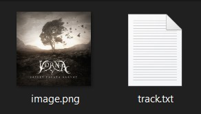
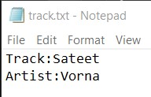
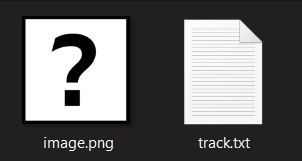

# LastFM4OBS
LastFM4OBS is a tool used to get the information of a currently playing track from a user's last.fm profile and store details into a text file and the album art to a local PNG.
Somewhat configurable using a config file. Created to show now playing information on a stream created in OBS.

While other tools have been created for this purpose, they have either a) not been configurable to the degree I would like or b) are locked to particular services (e.g. Spotify, Apple Music)

# Configuration
The `config.ini` file has two categories of options, namely, `LOCAL`, and `last.fm`
## `LOCAL`
`LOCAL` considers how the data where and how the last.fm data is stored

`directory`: Select the directory where you'd like the last.fm information to be stored

`format`: The format in which you'd like the textual information displayed. The format options are:

|Option|Description|
|---|---|
|%%TRACK|Track name|
|%%ARTIST|Artist name|
|%%ALBUM| Album name|
|\\\n | Newline character|
|\\\t | Tab character|

## `last.fm`
The `last.fm` category only considers which username is to be examined

`username`: The id of the user who you want to get last.fm recently played data for (most likely your own account)

# Usage
* Configure the `config.ini` to your specifications

* Run LastFM4OBS.exe, a Windows command prompt will appear, leave this open for as long as you wish

## Example
With the format string of `Track:%%TRACK\\\nArtist:%ARTIST`, when the request from last.fm is satisfied, the target directory will look like the following:

With the text file containing:

However, when the album art cannot be retrieved for whatever reason, the target directory will look like the following:

With the text file containing the correct information:

If the track cannot be retrieved at all or no track is currently playing, the text and image files will not update.

# Issues
There are several known issues:

* Occasionally last.fm will return bad information even if it displayed fine on the last.fm website. I'm investigating how to fix this

* When using images with OBS, sometimes the image won't display. This is due to OBS's refreshing time when an image is updated

* Some songs are just not listed on last.fm and will not be displayed. An error will instead be logged

Any other issues please submit a bug report.

# Enhancements
Several features coming soon:

* More configurable config file

* Better error handling

* Display more music data

Feature requests are welcome! :D